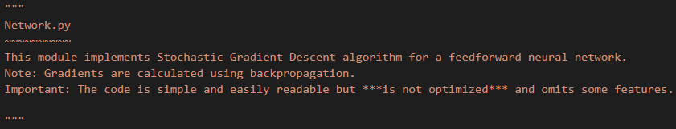
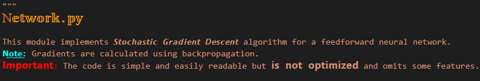
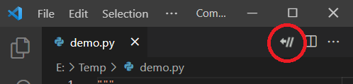
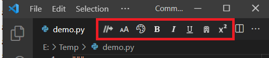
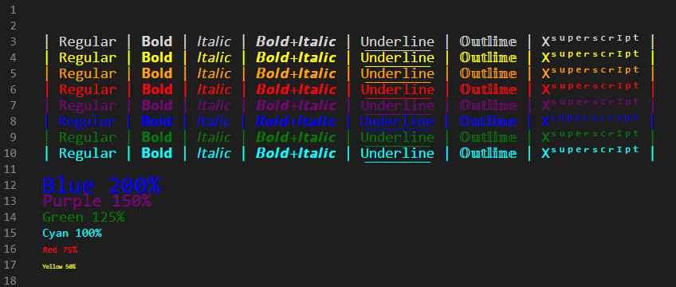
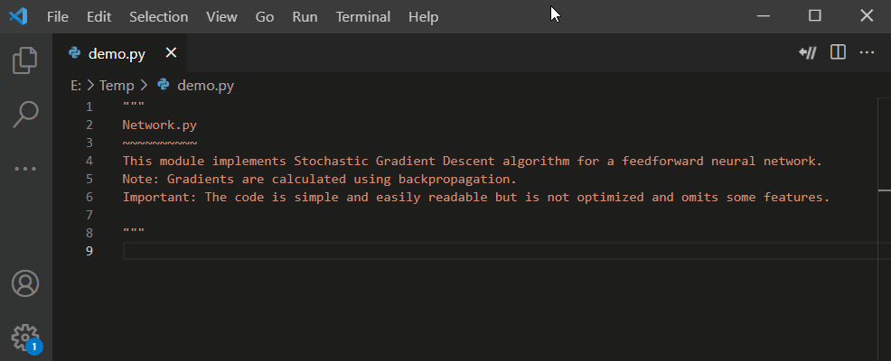
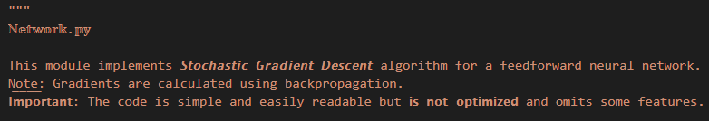
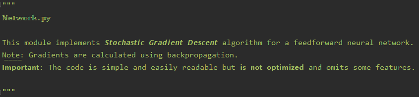
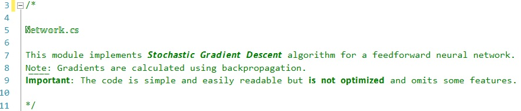

# Comment Styler


This extension allows you to add style to your code comments as if you were using a word processor. 
It supports comments in any programming language (Javascript, Python, C#, C++,...) or even plain text files.

Let's take this comment for example:



Wouldn't it be nice to style the comment as if it was a Word document?



## Features

The extension supports the following styles:

* Bold
* Italic
* Underline
* Outline
* Superscript
* Font size
* Font color

To use these tools, first open the tool "drawer":



Then, select the requested tool:




### Example - All styles together...


## Demo 




# Compatibility with other editors

You may ask, "what would happen if I share the file with my friend who does not use this extension?".
Moreover, perhaps you use VSCode, but your colleague use a completely different IDE...

To address this issue, the extension saves the styling as standard Unicode characters - as much as possible. 
Since Unicode does not support font size or color this type of information is encoded with invisible characters. 
This means that 𝗯𝗼𝗹𝗱, 𝘪𝘵𝘢𝘭𝘪𝘤𝘴, u͟n͟d͟e͟r͟l͟i͟n͟e, 𝕠𝕦𝕥𝕝𝕚𝕟𝕖 and other styles are viewable in other IDEs, while color and font size will be ignored and will be displayed as plain text.

<u>**Important**</u>: The actual result may differ depending on the font type used in the editor. 
Also, even if an editor displays the text as expected this behavior may break in future versions of the editor - we have no control over that!
  
  
  
##  Examples of how other IDEs display a file saved with the extension

### VSCode <u>without</u> the extension:



### PyCharm (ver 2019.3):



### Visual Studio 2019:




## Configuration

```js
{
  "commentStyler.useDrawer": true,  // Hide style options until drawer button is clicked
  "commentStyler.serifFont": false, // Should Bold and Italics use serif font (letters with small extra stroke)
}
```


## Known Issues

► In *PyCharm* 2019, the hidden codes (for color/font size) may become visible. 
They can be removed by clicking "Enable font ligatures" under `Settings->Editor->Font`

► *Notepad++* may not display underscores correctly, to fix that please change the default font from `Settings->Style Configurator->Default Style->Font Name` and change to a suitable font, for example "Courier" or "System".

► Recent versions of *PyCharm* (2021?) started displaying codes instead of invisible Unicode characters. 

► If you encounter slowness while typing try disabling other extensions, especially ones that perform styling while typing.

► Spell checkers may not identify unicode characters as regular letters.
In order to avoid marking all styled text as typo you can instruct the spell checker to ignore these characters.
For example, for *Code Spell Checker*, add the following setting:
<pre>
"cSpell.ignoreRegExpList": [
  "/[𝕒-𝕫𝔸-𝕐ℂℍℕℙℚℝℤ𝟘-𝟡𝙖-𝙯𝘼-𝙕𝗮-𝘇𝗔-𝗭𝘢-𝘻𝘈-𝘡͟ᵃ-ᶻᴬ-ᵂ𝐚-𝐳𝐀-𝐙𝑎-𝑧𝐴-𝑍𝒂-𝒛𝑨-𝒁̶]+/ug"
]
</pre>

