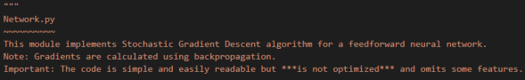
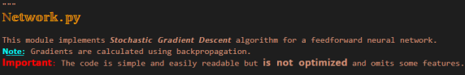
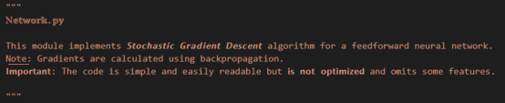
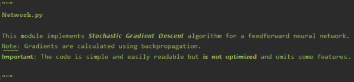
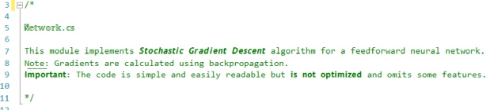
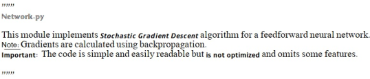

# Comment Styler


This extension allows you to add style to your code comments as if you were using a word processor. 

Let's take this comment for example:



Wouldn't it be nice to style the comment as if it was a Word document?




Now you may ask, "what would happen if I share this code with my friend who does not use this extension?".
Moreover, perhaps you use VSCode, but your colleagues use a completely different IDE...

To address this issue, the extension saves the styling as standard Unicode characters - as much as possible. 
However, since Unicode does not support font size or color this type of information is encoded with invisible characters. 
This means that 𝗯𝗼𝗹𝗱, 𝘪𝘵𝘢𝘭𝘪𝘤𝘴, u͟n͟d͟e͟r͟l͟i͟n͟e, 𝕠𝕦𝕥𝕝𝕚𝕟𝕖 and other styles are viewable in other IDEs, while color and font size will be ignored.

<u>**Important**</u>: The actual result may differ depending on the font type used in the editor. 
Also, even if an editor displays the text as expected this behavior may break in future versions of the editor - we have no control over that!


**Here are some examples:**

VSCode <u>without</u> the extension:



PyCharm 2019.3:



Visual Studio 2019:



Even good old Notepad:




## Features

Describe specific features of your extension including screenshots of your extension in action. Image paths are relative to this README file.

For example if there is an image subfolder under your extension project workspace:

\!\[feature X\]\(images/feature-x.png\)

> Tip: Many popular extensions utilize animations. This is an excellent way to show off your extension! We recommend short, focused animations that are easy to follow.

\
## Extension Settings

```js
{
  "commentStyler.useDrawer": true, // Hide style options until drawer button is clicked
  "commentStyler.serifFont": false, // Should Bold and Italics use serif font (letters with small extra stroke)
}
```
## Known Issues

► In 𝘗𝘺𝘊𝘩𝘢𝘳𝘮, the hidden codes (for color/font size) may become visible. 
They can be removed by clicking "Enable font ligatures" under Settings->Editor->Font

► If you encounter slowness while typing try disabling other extensions, especially colorizing ones like "𝘉𝘳𝘢𝘤𝘬𝘦𝘵 𝘗𝘢𝘪𝘳 𝘊𝘰𝘭𝘰𝘳𝘪𝘻𝘦𝘳".

► Spell checks may not identify unicode characters correctly
For cSpell users, add the following setting:
<pre>
"cSpell.ignoreRegExpList": [
  "/[𝕒-𝕫𝔸-𝕐ℂℍℕℙℚℝℤ𝟘-𝟡𝙖-𝙯𝘼-𝙕𝗮-𝘇𝗔-𝗭𝘢-𝘻𝘈-𝘡͟ᵃ-ᶻᴬ-ᵂ𝐚-𝐳𝐀-𝐙𝑎-𝑧𝐴-𝑍𝒂-𝒛𝑨-𝒁̶]+/ug"
]
</pre>

